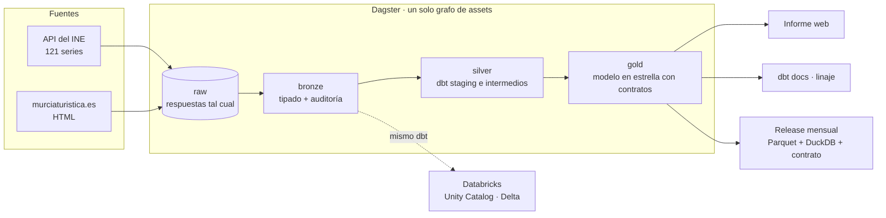

# Estacionalidad turística en la Región de Murcia

[](https://github.com/marnau74/murcia-open-data/actions/workflows/ci.yml)
[](https://github.com/marnau74/murcia-open-data/actions/workflows/publicar.yml)
[](LICENSE)

Plataforma de datos abiertos sobre el alojamiento turístico en la Región de Murcia. Ingiere
dos fuentes oficiales, las organiza por capas en un warehouse, las transforma con dbt a un
modelo en estrella, valida su calidad (incluido el cuadre entre fuentes) y publica cada mes,
sin intervención manual, un informe web, la documentación con el linaje y los datos.

**[Ver el informe →](https://marnau74.github.io/murcia-open-data/)** ·
[Documentación y linaje de los datos](https://marnau74.github.io/murcia-open-data/docs/) ·
[Descargar los datos](https://github.com/marnau74/murcia-open-data/releases)

[](https://marnau74.github.io/murcia-open-data/)

## La pregunta

¿Cómo se reparte la demanda de alojamiento turístico en la Región de Murcia a lo largo del
año y del territorio, cuánto empleo mueve y cómo evolucionan los precios? El sector es muy
estacional; este proyecto lo cuantifica con datos oficiales.

## Resultados

Con datos hasta agosto de 2026 (las cifras al día están en el informe, que las recalcula en
cada ejecución):

- **5,8 millones de pernoctaciones en 2025**, un 8 % más que en 2019. El 39 % fueron fuera de
  los hoteles: campings, apartamentos y turismo rural.
- **La costa concentra su año en verano.** En sus hoteles, agosto reúne el 18,2 % de las
  pernoctaciones anuales y diciembre el 2,2 %: una relación agosto/enero de 7,5, frente a 1,6
  en las ciudades.
- **Los campings tienen dos temporadas.** Son el tipo de alojamiento que más reparte el año:
  enero les deja casi el 10 % de sus pernoctaciones, más que junio.
- **Recuperación desigual tras la pandemia.** En 2025, con 2019 como base 100, los campings
  están en 114, los hoteles en 109 y los apartamentos en 95.
- **El empleo sigue a la temporada:** los hoteles pasaron de 1.621 personas empleadas en
  enero de 2025 a 2.695 en agosto.
- **Precios hoteleros:** desde 2008 han subido menos en la Región (índice 134,6) que en el
  conjunto de España (182,9).

## Arquitectura



| Capa | Dónde | Contenido |
|---|---|---|
| raw | `data/raw/<fuente>/` | Respuestas originales de las fuentes; inmutable |
| bronze | DuckDB, esquema `bronze` | Una tabla por fuente, tipada, con `_fichero_origen` e `_ingestado_en` |
| silver | dbt (`staging`, `intermediate`) | Datos limpios y reglas de negocio (secreto estadístico, meses sin publicar) |
| gold | dbt (`marts`) | Modelo en estrella con contratos: lo único que se consume |

GitHub Actions ejecuta la calidad en cada cambio (`ci.yml`, sin red) y, el día 3 de cada mes,
el pipeline completo con datos reales y la publicación (`publicar.yml`).

**Sobre la escala:** son decenas de miles de filas. Las herramientas se han elegido por las
prácticas que permiten (tests, contratos, linaje, reproducibilidad), no por volumen, y
funcionarían igual con muchos más datos.

## Databricks

El mismo proyecto dbt se ejecuta también en **Databricks** (Unity Catalog y tablas Delta),
como segundo destino ([ADR 0005](docs/adr/0005-databricks-como-segundo-destino.md)):

- DuckDB para desarrollo y CI (gratis, rápido, sin cuenta); Databricks como entorno en la
  nube. Ningún modelo tiene dos versiones: lo poco que cambia entre motores está en macros
  con `adapter.dispatch`.
- Bronze se sube a un volume de Unity Catalog y un **Databricks Asset Bundle**
  (`databricks.yml`) define el job que ejecuta `dbt build` en un SQL warehouse serverless.
- Tras cada ejecución, un **test de paridad** compara filas y sumas de cada tabla de gold en
  los dos motores: son idénticas.

## Modelo de datos

| Hecho ↓ / Dimensión → | fecha | territorio | tipo de alojamiento | residencia |
|---|:-:|:-:|:-:|:-:|
| `fct_demanda_mensual` (viajeros, pernoctaciones) | ✓ | ✓ | ✓ | ✓ |
| `fct_oferta_mensual` (establecimientos, plazas, empleo, ocupación %) | ✓ | ✓ | ✓ | |
| `fct_precios_mensual` (índice de precios hoteleros) | ✓ | ✓ | ✓ | |

`dim_territorio` une las geografías de las dos fuentes en una jerarquía explícita: la zona
«Costa Cálida» del INE no es la «costa» de murciaturistica, así que nunca se suman niveles ni
fuentes distintos.

## Calidad de los datos

`dbt build` y Dagster ejecutan 100 comprobaciones antes de publicar nada (98 tests de dbt, de datos
y unitarios, y 2 de Dagster sobre bronze): grano de cada tabla, relaciones, rangos, contratos,
cuadre de cada zona con su total publicado, que ninguna serie del catálogo se quede sin datos y
tests unitarios de la lógica de negocio.

**Validación cruzada entre fuentes.** murciaturistica y el INE salen de la misma encuesta: la
suma de los destinos debe coincidir con el total hotelero regional del INE. En los 115 meses
comunes, las pernoctaciones cuadran salvo por redondeo (máximo 5 en un mes de ~300.000). La
única diferencia real, los viajeros de agosto a diciembre de 2016, está documentada como
excepción ([ADR 0004](docs/adr/0004-validacion-cruzada-entre-fuentes.md)).

## Decisiones

Registradas como ADR en [`docs/adr/`](docs/adr/README.md). Las más relevantes:

- **DuckDB** como warehouse: un fichero, sin servidor, reproducible con un `git clone`.
- **Dagster** con *assets*: el linaje va de la API del INE al mart final en un solo grafo.
- **Secreto estadístico:** murciaturistica publica 0 en los destinos cuando hay pocas
  respuestas, pero mantiene el total de zona. Un destino «no desglosado» por zona recoge la
  diferencia: sin él, la costa perdía 962.644 pernoctaciones y su relación agosto/enero
  salía de 9,4 en vez de 7,5.
- **Meses sin publicar:** un mes sin datos es un dato ausente, nunca un 0.
- **Fuentes por código de serie**, no por tabla, y un catálogo generado a partir de los
  metadatos del INE: si el INE publica algo que no se sabe clasificar, falla en vez de
  adivinar.

## Datos publicados

Cada mes se publica una *release* `datos-AAAA-MM` con la capa gold:

| Fichero | Para qué |
|---|---|
| `*.parquet` | Una tabla por fichero: pandas, Power BI, Spark… |
| `murcia_turismo.duckdb` | Todas las tablas en un fichero (esquema `gold`) |
| `contrato.json` | Versión del contrato, tablas, columnas, tipos y filas |
| `SHA256SUMS` | Comprobación de la descarga (`sha256sum -c SHA256SUMS`) |

```python
import duckdb

duckdb.sql("SELECT * FROM 'fct_demanda_mensual.parquet' LIMIT 5")
```

El contrato sigue versionado semántico: un cambio que rompe a quien consume los datos (quitar
o renombrar una columna, cambiar un tipo) sube la versión mayor.

## Fuentes

- **INE**, API JSON pública: encuestas de ocupación en hoteles (EOH), apartamentos turísticos
  (EOAP), campings (EOAC) y turismo rural (EOTR), e índice de precios hoteleros (IPH). Región,
  Costa Cálida, Cartagena y Murcia, desde 2015.
- **murciaturistica.es** (Instituto de Turismo de la Región de Murcia, elaborado por el CREM):
  viajeros y pernoctaciones hoteleras en los 11 destinos turísticos oficiales, de 2015 a 2024.
  El endpoint no está documentado como API; sus particularidades están explicadas en
  [`murciaturistica_client.py`](src/murcia_data/ingest/murciaturistica_client.py).

## Cómo ejecutarlo

Requiere [uv](https://docs.astral.sh/uv/) (instala Python 3.12 o 3.13 si hace falta).

```bash
uv sync                                                  # entorno y dependencias exactas
uv run dagster job execute -m murcia_data.definitions -j pipeline_mensual   # todo el pipeline
uv run python -m murcia_data.report.build_site           # informe en site/index.html
uv run python -m murcia_data.release                     # paquete de datos en release/
```

Con `uv run dagster dev` se abre la interfaz de Dagster (http://localhost:3000) con el grafo
completo. Cada paso se puede lanzar también por separado:

```bash
uv run python -m murcia_data.ingest.ine                  # 121 series del INE a data/raw/ine/
uv run python -m murcia_data.bronze                      # raw a DuckDB (data/warehouse.duckdb)
uv run dbt build --project-dir dbt --profiles-dir dbt    # silver y gold: modelos y tests
```

Calidad: `uv run pytest`, y `uv run pre-commit install` activa las mismas comprobaciones que
la CI (ruff, sqlfluff y un control que impide subir rutas locales o correos personales).

## Estructura

```
src/murcia_data/
  ingest/        clientes de las fuentes (solo traen datos, no transforman)
  bronze.py      raw a DuckDB
  definitions.py grafo de Dagster: assets, comprobaciones y programación
  report/        indicadores (SQL sobre gold) y plantilla de la web
  release.py     paquete de datos para las releases
  databricks.py  bronze a Unity Catalog y paridad de gold entre motores
databricks.yml   Databricks Asset Bundle: job de dbt en Databricks
dbt/
  models/        staging, intermediate y marts
  seeds/         catálogo de series del INE, territorios y excepciones documentadas
  tests/         tests singulares y genéricos propios
tests/           pytest, con respuestas reales de las fuentes recortadas como fixtures
docs/adr/        decisiones de arquitectura
```

## Stack

Python · uv · ruff · requests · DuckDB · dbt · Dagster · Databricks (Unity Catalog, Delta,
Asset Bundles) · pytest · sqlfluff · GitHub Actions · GitHub Pages · Observable Plot

## Licencia

Código bajo licencia [MIT](LICENSE). Los datos pertenecen a sus autores (INE, Instituto de
Turismo de la Región de Murcia y CREM) y no se redistribuyen en el código del repositorio:
el pipeline los descarga de las fuentes originales, y las releases contienen solo los datos
derivados, con la atribución correspondiente.
