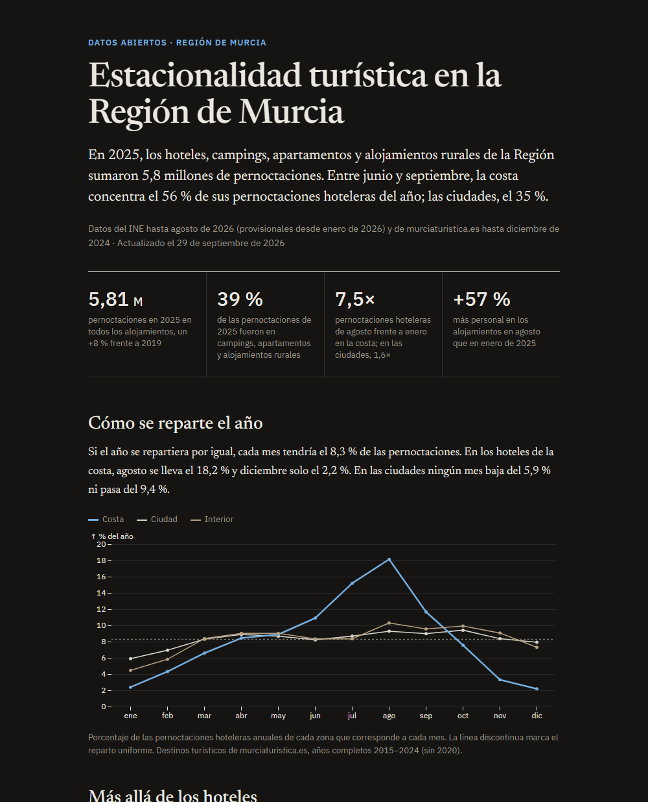

# Estacionalidad turística en la Región de Murcia

[](https://github.com/marnau74/murcia-open-data/actions/workflows/pipeline.yml)
[](LICENSE)

Pipeline de datos abiertos que ingiere estadística pública, la transforma a un
modelo dimensional, valida su calidad y publica un informe web que se
actualiza solo cada mes.

**[Ver el informe →](https://marnau74.github.io/murcia-open-data/)**

> **En evolución hacia la v2:** más fuentes (API del INE), transformaciones en dbt sobre
> DuckDB, orquestación con Dagster y despliegue en Databricks. La v1 queda en el tag
> [`v1.0.0`](https://github.com/marnau74/murcia-open-data/tree/v1.0.0); los cambios, en el
> [CHANGELOG](CHANGELOG.md).

[](https://marnau74.github.io/murcia-open-data/)

## La pregunta

¿Cómo se comporta la demanda hotelera en la Región de Murcia a lo largo del
año, y qué diferencia hay entre la costa, las ciudades y el interior? El
sector es muy estacional; este proyecto lo cuantifica con datos oficiales.

## Resultados

Con datos de enero de 2015 a diciembre de 2024 (las cifras al día están en el
informe, que las recalcula en cada ejecución):

- **La costa concentra su año en verano.** Agosto reúne el 18,2 % de sus
  pernoctaciones anuales y diciembre el 2,2 %: una relación agosto/enero de
  7,5 frente a 1,6 en las ciudades y 2,3 en el interior.
- **Estancias más largas y más turismo extranjero en la costa:** 3,4 noches
  de media (1,75 en las ciudades) y un 30 % de pernoctaciones de no residentes.
- **Recuperación desigual tras la pandemia.** En 2024, con 2019 como base
  100, el interior está en 123, las ciudades en 111 y la costa en 97.

## Fuente de datos

**murciaturistica.es** (Instituto de Turismo de la Región de Murcia): serie
mensual de viajeros y pernoctaciones en establecimientos hoteleros por destino
turístico, elaborada por el CREM a partir de la Encuesta de Ocupación Hotelera
del INE. El endpoint no está documentado como API pública; se descubrió
navegando la web y sus particularidades están explicadas en
[`murciaturistica_client.py`](src/murcia_data/ingest/murciaturistica_client.py).

Se descartaron tras explorarlas: el INE en bruto (solo distingue Cartagena /
Murcia capital / Costa Cálida, sin el desglose de 11 destinos que sí ofrece la
fuente elegida) y los portales CKAN regionales y municipales (uno solo tiene
directorios de establecimientos, no series de demanda; el del Ayuntamiento de
Murcia es inalcanzable).

## Arquitectura

```
murciaturistica.es (destinos)
      │  ingest/              cliente de solo lectura, con caché local
      ▼
data/raw/                     HTML crudo por mes (no versionado)
      │  transform/           modelo estrella (pandas)
      ▼
data/processed/*.parquet      fact + dimensiones
      │  quality/             validaciones (nulos, duplicados, integridad,
      │                       rangos y cuadre con los totales publicados)
      │  report/              indicadores + generación de la web
      ▼
site/index.html               publicado en GitHub Pages
```

GitHub Actions ejecuta los tests en cada push y pull request. El día 1 de cada
mes, además, lanza el pipeline completo y vuelve a publicar la web. El
pipeline pide hasta el mes anterior al actual, así que incorpora los datos
nuevos en cuanto la fuente los publica.

### Modelo estrella

- `fact_ocupacion`: viajeros y pernoctaciones (residentes / no residentes) por
  destino y mes.
- `dim_destino`: nombre y zona (ciudad / costa / interior). Es la
  clasificación oficial del Instituto de Turismo, no una inventada para este
  proyecto.
- `dim_fecha`: fecha, año, mes, trimestre.

## Decisiones sobre los datos

### Secreto estadístico

Cuando el grado de respuesta de las encuestas es bajo, la fuente publica 0 en
los destinos individuales pero mantiene el subtotal real de la zona. Sumar
solo los destinos perdía 962.644 pernoctaciones de costa en 45 meses (sobre
todo de invierno), un 3,5 % del total. Eso exageraba la estacionalidad de la
costa: relación agosto/enero de 9,4 en vez del 7,5 real.

Por eso `dim_destino` incluye un miembro `(no desglosado)` por zona que recoge
esa diferencia, y `quality/` valida en cada ejecución que sumar una zona
reproduce exactamente el total publicado. La columna `desglosado` permite
excluir esos miembros del análisis por destino sin falsear los agregados por
zona.

### Meses sin publicar

Para los meses que no publica (marzo a junio y diciembre de 2020, y cualquier
mes posterior al último disponible), la fuente no devuelve un error sino la
tabla entera a 0. Tratarlos como meses con cero turistas hundiría las medias,
así que se excluyen de la tabla de hechos y no se guardan en caché. Las
comparaciones entre meses del informe usan solo años completos.

## Cómo ejecutarlo

Requiere [uv](https://docs.astral.sh/uv/) (instala Python 3.12 o 3.13 si hace falta).

```bash
uv sync                                          # entorno y dependencias exactas (uv.lock)
uv run pytest                                    # tests de transformación, calidad e indicadores
uv run python -m murcia_data.pipeline            # ingesta + transformación + validación
uv run python -m murcia_data.report.build_site   # genera site/index.html
```

Para contribuir: `uv run pre-commit install` activa las mismas comprobaciones que la CI
(ruff para lint y formato).

La primera ejecución descarga unos 120 meses con una pausa entre peticiones
para no sobrecargar la fuente; las siguientes usan la caché de `data/raw/`.

## Estructura

```
src/murcia_data/
  ingest/      cliente HTTP de la fuente (solo trae datos, no transforma)
  transform/   construcción del modelo estrella
  quality/     comprobaciones reutilizables desde el pipeline y los tests
  report/      indicadores y plantilla de la web
  pipeline.py  punto de entrada
tests/         tests con pytest
docs/adr/      decisiones de arquitectura
```

Las decisiones de diseño están documentadas como ADR en [`docs/adr/`](docs/adr/README.md).

## Stack

Python · uv · ruff · pandas · requests · pyarrow · pytest · GitHub Actions ·
GitHub Pages · Observable Plot

## Licencia

Código bajo licencia [MIT](LICENSE). Los datos pertenecen a sus autores (Instituto
de Turismo de la Región de Murcia, CREM e INE) y no se redistribuyen en este
repositorio: el pipeline los descarga de la fuente original.
